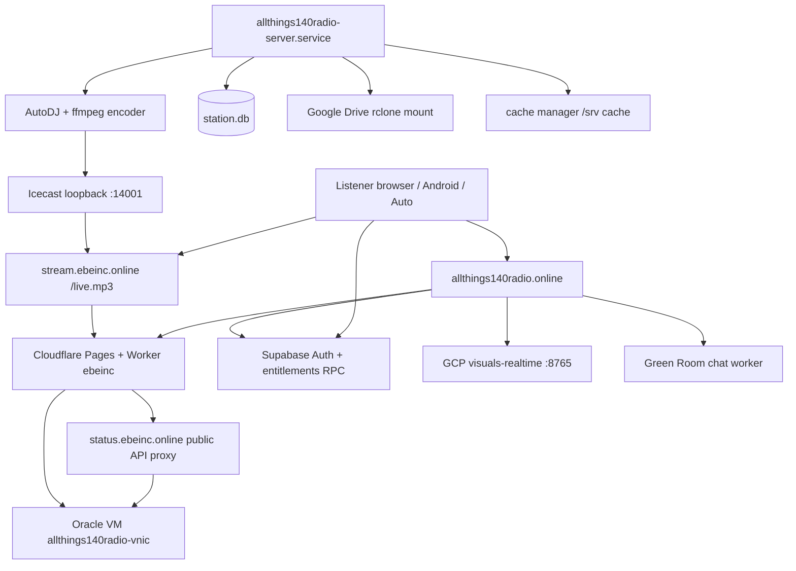

# ALLTHINGS140 Production Architecture (verified 2026-09-14 UTC)

## System map

## Component truth table

| Component | Source | Production location | Runtime | Public URL |
|-----------|--------|---------------------|---------|------------|
| Website + worker | `Projects/AllThings140Radio/radio/` | Cloudflare Pages `ebeinc` | Pages + `_worker.js` | https://allthings140radio.online |
| Public API gateway | `tools/server.py` PublicGatewayHandler | Oracle loopback :14080 (Tailscale) | python3 systemd | https://status.ebeinc.online/api/public/* |
| Broadcast authority | `tools/server.py` AutoDJ | `/opt/allthings140radio-server/server.py` | systemd `allthings140radio-server` | stream via tunnel |
| Icecast | packaged config | `/etc/allthings140radio/icecast.xml` | `allthings140radio-icecast` | proxied as stream.ebeinc.online |
| Database | SQLite | `/var/lib/allthings140radio/station.db` | server process | internal |
| Listener accounts | Supabase | hosted project | RPC `account_role_state` | via site/app |
| DJ/station users | SQLite `users` | same DB | server auth | DJ tools only |
| Visuals realtime | `visuals-realtime/` | GCP `/opt/allthings140-visuals-realtime` | systemd :8765 | via Pages / room |
| Android app | `android/mobile-app/` | Play internal / sideload | `online.ebeinc.allthings140radio` | N/A |

## Verified deployment pins

- **Pages production commit:** `f4e8055` (branch label `main` in Pages UI; local git on `fix/visuals-24-7-compositor`)
- **Oracle server.py SHA256:** `6adefaac04d92805880c5bac59634c88b181f5fdbefb65de32d9dcb2f45dc22a` (matches local `tools/server.py`)
- **Server VERSION:** `0.8.0`
- **Production `app.js`:** byte-identical to local `radio/app.js`
- **Production `sw.js`:** `allthings140-radio-v74`, byte-identical to local

## Alert architecture (account-aware)

1. **Global stream injection:** OFF (`server_stream_alert_injection_enabled: false` in production `ads.json` and live `/api/public/alert-catalog`).
2. **Client account alerts:** ON — REGULAR listeners receive overlays via web shell / Android second player; entitled roles blocked server-side via Supabase RPC before playback.
3. **AutoDJ stream mix:** `shared_stream_asset_allowed()` fail-closed — promotional/client-delivery ads cannot enter Icecast unless explicitly classified as common station programming.

## Network paths

- Oracle Tailscale: `100.124.12.41` (`allthings140radio-server`)
- Public stream: Cloudflare → tunnel (`allthings140radio-tunnel`) → Icecast/auth relay
- API: Cloudflare worker proxies read-only public routes to `status.ebeinc.online` origin
